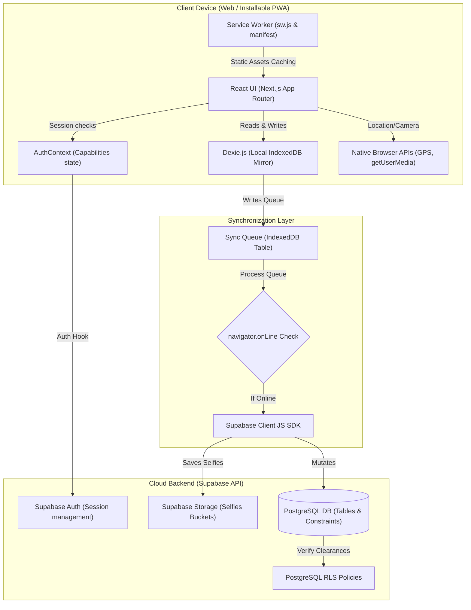

# Nexus CRM — System Architecture & Workflow Documentation

Welcome to the internal technical manual for **Nexus CRM** (bootstrapped as `CRM_Zero`). This documentation provides a comprehensive analysis of the system architecture, data flow, offline capabilities, front-end workflows, and backend requirements for the Progressive Web App (PWA).

---

## 1. System Architecture & Tech Stack

Nexus CRM is designed as a secure, offline-first Progressive Web Application (PWA). It enables field agents, support teams, and administrators to view and sync corporate data reliably under poor network conditions, using local storage cache mirroring to update the backend database.



### Technology Stack Table

| Layer | Technology | Operational Purpose |
|---|---|---|
| **Core Framework** | Next.js 15 (React 19) | App router layout framework supporting server components and single-page routing structures. |
| **Styling System** | CSS Modules & Tailwind CSS | Dynamic responsive designs with premium visual aesthetics (glassmorphism dashboard layouts). |
| **Local Database** | Dexie.js (IndexedDB wrapper) | Client-side reactive memory storage caching database schemas and syncing mutations. |
| **Cloud Backend** | Supabase (Postgres + Auth + Storage) | Managed database backend handles user credentials, Row Level Security (RLS) policies, and static asset storage (biometric check-in photos). |
| **Native Integrations**| Geolocation API & Camera API | Captured in real-time by the browser sandbox to perform anti-fraud GPS verification and facial captures. |
| **Offline Engine** | Service Worker (`sw.js`) | Network-first fetching model caching essential app shells to boot the system fully offline. |

---

## 2. File and Directory Structure

The repository is modularized into isolated contexts, custom libraries, database schemas, page routes, and service worker configurations.

```
CRM_Zero/
├── public/
│   ├── sw.js                 # Network-first cache service worker
│   └── manifest.json         # PWA app-store/home screen config descriptor
├── src/
│   ├── app/
│   │   ├── admin/
│   │   │   └── page.tsx      # Oracle User Capability Matrix dashboard
│   │   ├── attendance/
│   │   │   └── page.tsx      # GPS & facial biometric check-in page
│   │   ├── login/
│   │   │   └── page.tsx      # Entry screen supporting reviewer presets
│   │   ├── onboarding/
│   │   │   └── page.tsx      # Kanban board leads funnel & right drawer details panel
│   │   ├── support/
│   │   │   └── page.tsx      # Client query spreadsheet grid & Route Mapping Bridge
│   │   ├── layout.tsx        # Shell layout embedding responsive Side Navigation sidebar
│   │   └── page.tsx          # Executive dashboard metrics & operations charts
│   ├── components/
│   │   └── DashboardLayout.tsx# sidebar layouts, online/offline status, queue count ticker
│   ├── context/
│   │   └── AuthContext.tsx   # React global auth provider, capability RBAC hooks
│   └── lib/
│       ├── db.ts             # Dexie.js database definition, seed mock data, & sync handlers
│       ├── imageCompression.ts# Canvas compressor scaling base64 selfies to ~200KB
│       ├── supabaseClient.ts # Supabase connector initialization client
│       └── validation.ts     # Zod models for client validation & pipeline transition rules
```

* **Database Connection Details**: [db.ts](file:///c:/Users/dcp69/Desktop/CRM_Zero/src/lib/db.ts)
* **Supabase Configuration**: [supabaseClient.ts](file:///c:/Users/dcp69/Desktop/CRM_Zero/src/lib/supabaseClient.ts)
* **Zod Schemas**: [validation.ts](file:///c:/Users/dcp69/Desktop/CRM_Zero/src/lib/validation.ts)
* **Auth Context**: [AuthContext.tsx](file:///c:/Users/dcp69/Desktop/CRM_Zero/src/context/AuthContext.tsx)
* **Global Sidebar Layout**: [DashboardLayout.tsx](file:///c:/Users/dcp69/Desktop/CRM_Zero/src/components/DashboardLayout.tsx)

---

## 3. The Dynamic Capability-Based RBAC Model

Rather than locking a user profile to a singular rigid role (e.g. "Sales Agent"), Nexus CRM uses a **dynamic, admin-controlled capability-based access model**. 

Users are assigned one or more distinct capability keys in a many-to-many lookup database (`user_capabilities`). These capabilities instantly toggle specific front-end views, functional modules, and Postgres database query executions (RLS).

### Capability Codes Table

| Capability Code | Description | Authorized Operations |
|---|---|---|
| `admin` | System Administrator | Complete read/write override for every table. Access to Admin capability manager panel. |
| `dist_onboarding`| Distributor Onboarding | Register new distributor leads, move leads across the kanban pipeline. |
| `dist_support` | Distributor Support | View and query converted distributors. Log client queries and support tickets. |
| `ret_onboarding` | Retailer Onboarding | Register new retailer leads, move leads across the kanban pipeline. |
| `ret_support` | Retailer Support | View and query converted retailers. Log client queries and support tickets. |
| `field_dist` | Field Agent (Distributor) | Conduct field visits to distributor facilities. Clock attendance. |
| `field_ret` | Field Agent (Retailer) | Conduct field visits to retailer shops. Clock attendance. |
| `tech_support` | Technical Support | Access technical bug and database ticket lists. Resolve issues. |

### Mixable Role Capabilities
An agent can hold multiple capabilities simultaneously. For example, assigning `dist_support` + `field_dist` dynamically yields a user dashboard that enables clocking in on-site, logging a client query, and linking distributor maps.

---

## 4. Local Database & Synchronization Mechanics

Nexus CRM utilizes an offline-first data synchronization engine powered by **Dexie.js** matching IndexedDB on the client side, and **Supabase** on the cloud side.

### Caching and Local Mutating Flow

1. **State Mutation**: When a front-end form issues a change (e.g., logging a call, creating a lead, or checking in), the application does not write to the server first. Instead, it writes directly to the local IndexedDB table via Dexie.
2. **Queuing for Sync**: After the Dexie write completes successfully, the change is saved into the local `sync_queue` table as a `SyncQueueItem`:
   ```typescript
   export interface SyncQueueItem {
     id?: number;
     table_name: string;
     action: "INSERT" | "UPDATE" | "DELETE";
     data: any;
     timestamp: string;
   }
   ```
3. **Queue Processing**: The sync engine immediately triggers a sync loop (`processSyncQueue()`).
   * **If Online (`navigator.onLine === true`)**: The sync engine processes each queue entry in order, invoking the equivalent `supabase-js` API action. If the server mutation completes, the queue item is removed. If a network timeout occurs, processing pauses to maintain event ordering.
   * **If Offline**: The sync loop is skipped. The user continues to read/write locally. A visual counter in the sidebar displays the number of pending changes.
4. **Auto-Reconnection Sync**: A global event listener listens for browser connection switches:
   ```typescript
   if (typeof window !== "undefined") {
     window.addEventListener("online", () => {
       processSyncQueue().catch(console.error);
     });
   }
   ```

### Segment Data Segregation Stream
To secure local devices and optimize network traffic, data is filtered on sync load according to the user's active capabilities. Retailer-only agents do not download distributor leads, and vice-versa, utilizing the `filterSyncStream()` helper:

```typescript
export function filterSyncStream<T extends { segment_type?: LeadSegment; lead_id?: string }>(
  items: T[], 
  userCapabilities: string[],
  leadsLookup: Record<string, LocalLead>
): T[] {
  if (userCapabilities.includes("admin") || userCapabilities.includes("tech_support")) {
    return items;
  }
  const hasDist = userCapabilities.some(c => ["dist_onboarding", "dist_support", "field_dist"].includes(c));
  const hasRet = userCapabilities.some(c => ["ret_onboarding", "ret_support", "field_ret"].includes(c));

  return items.filter(item => {
    if (item.segment_type) {
      if (item.segment_type === "Distributor" && hasDist) return true;
      if (item.segment_type === "Retailer" && hasRet) return true;
      return false;
    }
    if (item.lead_id && leadsLookup[item.lead_id]) {
      const seg = leadsLookup[item.lead_id].segment_type;
      if (seg === "Distributor" && hasDist) return true;
      if (seg === "Retailer" && hasRet) return true;
      return false;
    }
    return true;
  });
}
```

---

## 5. Page-by-Page Workflow & Front-End Design

### A. Login Portal (`/login`)
The entry point matches credentials to initialize user states.
* **Reviewer Presets**: Quick buttons load preset email credentials (`alice@crm.org` as Admin, `bob@crm.org` as Retailer Support, etc.) with the default password `password123`.
* **State Bootstrapping**: Logging in verifies the account, queries [db.ts](file:///c:/Users/dcp69/Desktop/CRM_Zero/src/lib/db.ts) to find the user's assigned capabilities, sets the authentication state in `AuthContext`, and saves the session in `localStorage`.
* **Redirection**: Authenticated clients are automatically redirected to `/`. Unauthenticated clients attempting to view page routes are blocked and returned to `/login`.

### B. Executive Insights Dashboard (`/`)
Displays operational summaries based on client-side aggregates.
* **Interactive KPIs**: Calculates **Total Leads Managed**, **Overall Conversion Rate** (the ratio of leads reached registration/payment/installation vs total leads), **Pending Route Mappings**, and **Active Agents** from the local IndexedDB mirror.
* **Operational Activity Feed**: Gathers recent mutations made within local tables, showing a feed of newly created leads and completed route links.
* **Capabilities Widget**: A right-side status cards deck displaying the active capabilities of the logged-in agent.

### C. Pipeline Kanban Workspace (`/onboarding`)
An interactive Kanban board segmenting leads by Retailer or Distributor funnels.
* **Segment Toggles**: Switches between Distributor and Retailer funnels. The tabs are visible only if the user holds the matching `_onboarding` or `_support` capabilities.
* **Funnel Stages**: Cards are divided into vertical lanes: `New` ➔ `Contacted` ➔ `Interested` / `Not Interested` ➔ `Registration` ➔ `Payment` ➔ `Installation`.
* **Pipeline Transition Policy Rules**: Lead stages cannot bypass linear sequences (e.g. from `New` directly to `Installation`). Rules are validated using `validateLeadStatusTransition()` in [validation.ts](file:///c:/Users/dcp69/Desktop/CRM_Zero/src/lib/validation.ts):
  ```typescript
  export const ALLOWED_TRANSITIONS: Record<LeadStatus, LeadStatus[]> = {
    "New": ["Contacted"],
    "Contacted": ["Interested", "Not Interested"],
    "Interested": ["Registration"],
    "Not Interested": ["Contacted"],
    "Registration": ["Payment"],
    "Payment": ["Installation"],
    "Installation": []
  };
  ```
* **Right Drawer Panel**: Clicking a lead card opens a details panel from the right edge, allowing team members to:
  * Manually transition lead stages (allowed buttons are highlighted; disallowed stages are disabled).
  * View client contact profiles.
  * Log call outcome notes.
  * View historical call logs sorted in descending chronological order.

### D. Support & Route Mapping Bridge (`/support`)
Handles manual mapping requests and logs customer complaints.
* **Distributor-Retailer Bridge Builder**: Sales and support agents can search for converted leads of each segment to establish a route connection.
  * Select Source Distributor (Search + Dropdown filtering).
  * Select Target Retailer (Search + Dropdown filtering).
  * Input authority details (Requested By) and notes.
  * Click **Generate Mapping Link**. This writes a record to `mappings`, queues a Supabase insert sync, and generates a secure bridge verification URL.
* **Verification Queue**: Displays a list of pending mapping requests. Supporting agents can verify these links, updating the request status to `Resolved`.
* **Support Query Logs**: Log customer complaints for any lead. Resolving issues triggers status indicators (`Open` ➔ `In Progress` ➔ `Resolved`).

### E. Biometric Attendance GPS Scanner (`/attendance`)
Provides anti-fraud presence verification for field agents.
* **GPS Lock**: Retrieves coordinates using `navigator.geolocation` with high accuracy limits, verifying the agent's location.
* **Selfie Verification**: Uses `navigator.mediaDevices.getUserMedia` to display a live video feed. It triggers a scanning overlay and draws a frame snapshot to a hidden HTML5 canvas upon check-in.
* **Camera Fallback**: If browser permissions prevent camera access, the scanner gracefully falls back to generating a custom avatar image based on the agent's name.
* **Clock-in & Out Block**: Clocking in stores the GPS coordinates, time, and selfie URL locally, queuing a sync insert. Once checked in, the page displays a "Verified Active" status badge. The agent can clock out at shift end, updating the database.

### F. Admin Control Panel (`/admin`)
An administrative control center for capability management.
* **Restriction**: This page is restricted to users holding the `admin` capability code.
* **Team Capability Matrix**: Lists all corporate users from the database. Next to each user, an interactive grid of checkboxes represents all 8 system capabilities.
* **Dynamic Reassignment**: Toggling a checkbox adds or removes the corresponding record in `user_capabilities`, updates the context, and queues the change to sync with the Supabase backend.

---

## 6. Complete Backend Configuration Guide (Supabase PostgreSQL SQL Setup)

To construct this offline-first synchronization flow securely, you must configure the tables, validation constraints, security functions, and **Row Level Security (RLS) Policies** inside your Supabase PostgreSQL database.

Below is the production-ready SQL script to set up the backend:

```sql
-- =====================================================================
-- 1. BASE TABLES DEFINITIONS AND SEED DATA
-- =====================================================================

-- Enable UUID extension
create extension if not exists "uuid-ossp";

-- A. Users table (linked to auth.users in production, or mirror table)
create table public.users (
    user_id uuid primary key default gen_random_uuid(),
    name text not null,
    email text unique not null,
    password text, -- Plaintext field for reviewer presets login simulation
    is_active integer not null default 1,
    created_at timestamp with time zone default timezone('utc'::text, now()) not null
);

-- B. Capabilities lookup table
create table public.capabilities (
    code text primary key,
    label text not null
);

-- Seed capabilities
insert into public.capabilities (code, label) values
('admin', 'System Administrator'),
('dist_onboarding', 'Distributor Onboarding'),
('dist_support', 'Distributor Support'),
('ret_onboarding', 'Retailer Onboarding'),
('ret_support', 'Retailer Support'),
('field_dist', 'Field Distributor Agent'),
('field_ret', 'Field Retailer Agent'),
('tech_support', 'Technical Support')
on conflict (code) do nothing;

-- C. Many-to-many User Capabilities matrix table
create table public.user_capabilities (
    id uuid primary key default gen_random_uuid(),
    user_id uuid references public.users(user_id) on delete cascade not null,
    capability_code text references public.capabilities(code) on delete cascade not null,
    assigned_by uuid references public.users(user_id),
    assigned_at timestamp with time zone default timezone('utc'::text, now()) not null,
    constraint unique_user_capability unique (user_id, capability_code)
);

-- D. Leads table
create type lead_segment_enum as enum ('Distributor', 'Retailer');
create type lead_status_enum as enum ('New', 'Contacted', 'Interested', 'Not Interested', 'Registration', 'Payment', 'Installation');

create table public.leads (
    lead_id uuid primary key default gen_random_uuid(),
    business_name text not null,
    contact_person text not null,
    phone text not null,
    segment_type lead_segment_enum not null,
    status lead_status_enum not null default 'New',
    loss_reason text,
    assigned_to uuid references public.users(user_id) on delete set null,
    created_at timestamp with time zone default timezone('utc'::text, now()) not null,
    onboarded_at timestamp with time zone
);

-- E. Client queries table (Support tickets)
create type problem_status_enum as enum ('Open', 'In Progress', 'Resolved');

create table public.client_queries (
    query_id uuid primary key default gen_random_uuid(),
    lead_id uuid references public.leads(lead_id) on delete cascade not null,
    client_problem text not null,
    problem_status problem_status_enum not null default 'Open',
    assigned_to uuid references public.users(user_id) on delete set null,
    created_at timestamp with time zone default timezone('utc'::text, now()) not null,
    resolved_at timestamp with time zone
);

-- F. Mappings table (Distributor-Retailer maps)
create table public.mappings (
    mapping_id uuid primary key default gen_random_uuid(),
    distributor_lead_id uuid references public.leads(lead_id) on delete cascade not null,
    retailer_lead_id uuid references public.leads(lead_id) on delete cascade not null,
    requested_by text not null,
    mapped_by uuid references public.users(user_id) on delete set null,
    notes text,
    created_at timestamp with time zone default timezone('utc'::text, now()) not null,
    request_source text not null default 'Web Dashboard',
    completion_timestamp timestamp with time zone default timezone('utc'::text, now()) not null,
    constraint unique_distributor_retailer_map unique (distributor_lead_id, retailer_lead_id)
);

-- G. Mapping requests queue
create type mapping_request_status_enum as enum ('Pending', 'Resolved', 'Overdue');

create table public.mapping_requests (
    request_id uuid primary key default gen_random_uuid(),
    requester_id uuid references public.leads(lead_id) on delete cascade not null,
    assigned_to_id uuid references public.users(user_id) on delete set null,
    status mapping_request_status_enum not null default 'Pending',
    created_at timestamp with time zone default timezone('utc'::text, now()) not null,
    updated_at timestamp with time zone default timezone('utc'::text, now()) not null
);

-- H. Internal bugs & tickets table
create type ticket_category_enum as enum ('Access', 'Bug', 'Data', 'Other');
create type ticket_priority_enum as enum ('Low', 'Medium', 'High');

create table public.internal_tickets (
    ticket_id uuid primary key default gen_random_uuid(),
    raised_by uuid references public.users(user_id) on delete cascade not null,
    category ticket_category_enum not null default 'Other',
    priority ticket_priority_enum not null default 'Low',
    status problem_status_enum not null default 'Open',
    description text not null,
    assigned_to uuid references public.users(user_id) on delete set null,
    created_at timestamp with time zone default timezone('utc'::text, now()) not null,
    resolved_at timestamp with time zone
);

-- I. Attendance tracking table
create table public.attendance (
    attendance_id uuid primary key default gen_random_uuid(),
    user_id uuid references public.users(user_id) on delete cascade not null,
    date date not null default current_date,
    clock_in timestamp with time zone default timezone('utc'::text, now()) not null,
    clock_out timestamp with time zone,
    selfie_url text not null,
    latitude double precision not null,
    longitude double precision not null,
    constraint unique_user_attendance_date unique (user_id, date)
);

-- J. Call logs history table
create table public.call_logs (
    log_id uuid primary key default gen_random_uuid(),
    user_id uuid references public.users(user_id) on delete cascade not null,
    lead_id uuid references public.leads(lead_id) on delete cascade not null,
    timestamp timestamp with time zone default timezone('utc'::text, now()) not null,
    outcome text not null,
    notes text,
    next_followup_date timestamp with time zone
);

-- =====================================================================
-- 2. HELPER ROLE SECURITY CHECK FUNCTIONS
-- =====================================================================

-- Function to check if a user holds a specific capability key
create or replace function public.check_user_capability(query_user_id uuid, check_capability text)
returns boolean security definer as $$
begin
    -- Admin override
    if exists (
        select 1 from public.user_capabilities 
        where user_id = query_user_id and capability_code = 'admin'
    ) then
        return true;
    end if;

    -- Standard match check
    return exists (
        select 1 from public.user_capabilities 
        where user_id = query_user_id and capability_code = check_capability
    );
end;
$$ language plpgsql;

-- =====================================================================
-- 3. ROW LEVEL SECURITY (RLS) POLICIES CREATION
-- =====================================================================

-- Enable RLS on core operation tables
alter table public.leads enable row level security;
alter table public.client_queries enable row level security;
alter table public.mappings enable row level security;
alter table public.mapping_requests enable row level security;
alter table public.internal_tickets enable row level security;
alter table public.attendance enable row level security;
alter table public.call_logs enable row level security;

-- Policies for LEADS:
-- Distributor leads visible/editable if user holds dist_onboarding or dist_support.
-- Retailer leads visible/editable if user holds ret_onboarding or ret_support.
-- Admin overrides all.
create policy leads_rbac_read_policy on public.leads
    for select
    using (
        (segment_type = 'Distributor' and (public.check_user_capability(auth.uid(), 'dist_onboarding') or public.check_user_capability(auth.uid(), 'dist_support'))) or
        (segment_type = 'Retailer' and (public.check_user_capability(auth.uid(), 'ret_onboarding') or public.check_user_capability(auth.uid(), 'ret_support')))
    );

create policy leads_rbac_write_policy on public.leads
    for all
    using (
        (segment_type = 'Distributor' and (public.check_user_capability(auth.uid(), 'dist_onboarding') or public.check_user_capability(auth.uid(), 'dist_support'))) or
        (segment_type = 'Retailer' and (public.check_user_capability(auth.uid(), 'ret_onboarding') or public.check_user_capability(auth.uid(), 'ret_support')))
    );

-- Policies for CLIENT QUERIES:
-- Visible/editable if user holds support capability corresponding to query lead's segment type.
create policy queries_rbac_read_policy on public.client_queries
    for select
    using (
        exists (
            select 1 from public.leads l 
            where l.lead_id = public.client_queries.lead_id
            and (
                (l.segment_type = 'Distributor' and public.check_user_capability(auth.uid(), 'dist_support')) or
                (l.segment_type = 'Retailer' and public.check_user_capability(auth.uid(), 'ret_support'))
            )
        )
    );

create policy queries_rbac_write_policy on public.client_queries
    for all
    using (
        exists (
            select 1 from public.leads l 
            where l.lead_id = public.client_queries.lead_id
            and (
                (l.segment_type = 'Distributor' and public.check_user_capability(auth.uid(), 'dist_support')) or
                (l.segment_type = 'Retailer' and public.check_user_capability(auth.uid(), 'ret_support'))
            )
        )
    );

-- Policies for MAPPINGS:
-- Authorized to sales/support roles or admin.
create policy mappings_rbac_all_policy on public.mappings
    for all
    using (
        public.check_user_capability(auth.uid(), 'dist_onboarding') or
        public.check_user_capability(auth.uid(), 'dist_support') or
        public.check_user_capability(auth.uid(), 'ret_onboarding') or
        public.check_user_capability(auth.uid(), 'ret_support')
    );

-- Policies for MAPPING REQUESTS:
create policy map_requests_rbac_all_policy on public.mapping_requests
    for all
    using (
        public.check_user_capability(auth.uid(), 'dist_onboarding') or
        public.check_user_capability(auth.uid(), 'dist_support') or
        public.check_user_capability(auth.uid(), 'ret_onboarding') or
        public.check_user_capability(auth.uid(), 'ret_support')
    );

-- Policies for INTERNAL TICKETS:
-- Tech support or Admin can read/write all. Standard users read/write their own tickets.
create policy internal_tickets_read_policy on public.internal_tickets
    for select
    using (
        raised_by = auth.uid() or 
        public.check_user_capability(auth.uid(), 'tech_support')
    );

create policy internal_tickets_write_policy on public.internal_tickets
    for all
    using (
        raised_by = auth.uid() or 
        public.check_user_capability(auth.uid(), 'tech_support')
    );

-- Policies for ATTENDANCE:
-- Users read/write their own attendance records. Admin can read all.
create policy attendance_access_policy on public.attendance
    for all
    using (
        user_id = auth.uid() or 
        public.check_user_capability(auth.uid(), 'admin')
    );

-- Policies for CALL LOGS:
-- Read/write allowed if the user holds onboarding/support capabilities for the associated lead.
create policy call_logs_access_policy on public.call_logs
    for all
    using (
        exists (
            select 1 from public.leads l 
            where l.lead_id = public.call_logs.lead_id
            and (
                (l.segment_type = 'Distributor' and (public.check_user_capability(auth.uid(), 'dist_onboarding') or public.check_user_capability(auth.uid(), 'dist_support'))) or
                (l.segment_type = 'Retailer' and (public.check_user_capability(auth.uid(), 'ret_onboarding') or public.check_user_capability(auth.uid(), 'ret_support')))
            )
        )
    );
```

---

## 7. PWA configuration Details

For offline support, Nexus CRM integrates Progressive Web Application conventions:

1. **Manifest File** (`public/manifest.json`): Sets name headers, application icons, stand-alone window mode triggers, and the indigo brand theme color configuration `#6366f1` to make the application look like a native application when installed on mobile devices.
2. **Service Worker** (`public/sw.js`): Uses a network-first, cache-fallback routing strategy:
   * **Cache Loading**: Caches key application assets on install (`/`, `/favicon.ico`, `/manifest.json`).
   * **Fetch interception**: Intercepts outgoing HTTP/HTTPS fetch requests, requests the online network resources, and updates the local cache container dynamically.
   * **Offline Fallback**: If the network connection is lost or timeout throws errors, the service worker falls back to serving cached resource entries.
   * **Page Navigation**: Redirects offline URL page hits back to `/` to boot client-side routing logic inside the browser cleanly.

---

## 8. Summary of How Everything Connects

1. When the user navigates to the app, the Service Worker loads the cached app shell if they are offline.
2. The user signs in via `/login` with preset data.
3. `AuthContext` initializes, checks local IndexedDB, fetches the user's active capabilities, and maps layout clearances.
4. On `/onboarding`, the user registers a lead or transitions a card. The status checks are run client-side. The lead is saved to IndexedDB (`db.leads.add()`), and an mutation action is pushed to `db.sync_queue`.
5. If the network is online, the queue automatically triggers, invoking the Supabase SDK client to mutate the Supabase database. If the network is offline, the changes remain cached in the client's IndexedDB.
6. When the device returns online, the `online` event listener calls `processSyncQueue()`, batch-updating Supabase.
7. Supabase enforces capabilities server-side on every sync mutation using PostgreSQL Row-Level Security (RLS) policies.
